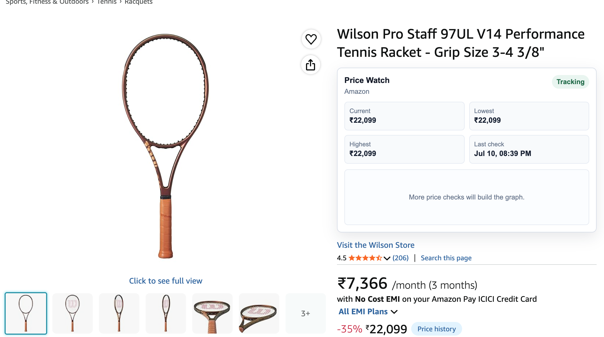
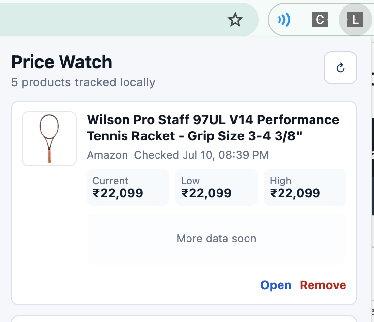

# Local Price Watch

Local Price Watch is a lightweight Chrome extension for tracking product price history on Amazon and Flipkart. It works like a small, local-first version of Keepa: open a supported product page, let the extension save it, and see a compact price-history widget injected into the product page.

All product data and price history stay on the user's device.

## Features

- Detects Amazon and Flipkart product pages automatically.
- Extracts product title, image, current price, canonical URL, store, and product identifier.
- Saves tracked products locally with `chrome.storage.local`.
- Uses a Manifest V3 background service worker and a single idempotent `chrome.alarms` schedule for periodic price refreshes.
- Re-registers the alarm safely when a supported product page is opened, so Chrome service worker shutdowns do not create duplicate jobs.
- Injects a compact Shadow DOM price widget directly into product pages.
- Shows current, lowest, highest, and last-checked prices.
- Provides a popup dashboard for all tracked products.
- Supports manual refresh and product removal.
- Uses custom SVG charts, so there is no build step and no charting dependency.

## Supported Sites

- Amazon India and Amazon US
- Flipkart

Site-specific parsing lives in [`src/shared/site-adapters.js`](src/shared/site-adapters.js), so more ecommerce sites can be added without changing the storage or UI layers.

## Install Locally

1. Clone or download this repository.
2. Open `chrome://extensions` in Chrome.
3. Enable **Developer mode**.
4. Click **Load unpacked**.
5. Select the repository folder.
6. Open a supported Amazon or Flipkart product page.

The extension will create a local tracking entry and inject the on-page chart widget.

## Screenshots

| Product page widget | Popup dashboard |
| --- | --- |
|  |  |

## Project Structure

```text
manifest.json
docs/
  screenshots/
    product-page-widget.png
    popup-dashboard.png
src/
  background/
    service-worker.js   # alarms, storage, scheduled refresh, offscreen parsing
    offscreen.html      # hidden document for DOMParser support
    offscreen.js
  content/
    content.js          # product-page extraction, save message, Shadow DOM widget
    widget.css          # legacy widget stylesheet kept for reference
  popup/
    popup.html          # tracked-products dashboard
    popup.css
    popup.js
  shared/
    site-adapters.js    # Amazon and Flipkart parsing logic
```

## How It Works

When a supported product page opens, the content script extracts product information from the DOM and sends it to the background service worker. The background worker stores the product locally, appends timestamped price history, and ensures the `local-price-watch-refresh` alarm exists.

Chrome may stop Manifest V3 service workers whenever they are idle. This extension does not try to keep the worker alive permanently. Instead, it uses `chrome.alarms` as the durable scheduler and makes setup idempotent, so repeated page visits do not create duplicate polling jobs.

For background refreshes, the service worker fetches tracked product pages, parses the HTML in an offscreen document, and updates local price history.

## Privacy

- No backend server.
- No analytics.
- No account system.
- No personal data collection.
- Tracked products and price history are stored locally in Chrome extension storage.

## Limitations

Ecommerce sites change markup often and may block automated fetches, return generic pages, or show bot/captcha pages. When that happens, Local Price Watch keeps the existing data and marks the product as needing attention instead of deleting history.

For the most reliable update, open the product page directly in Chrome. The content script can read the live rendered page after the store's client-side scripts finish loading.

## Development

There is no build step. Edit the source files, then reload the unpacked extension in `chrome://extensions`.

Useful checks:

```bash
python3 -m json.tool manifest.json >/tmp/local-price-watch-manifest.json
node --check src/shared/site-adapters.js
node --check src/background/service-worker.js
node --check src/background/offscreen.js
node --check src/content/content.js
node --check src/popup/popup.js
```

## License

No license has been added yet.
